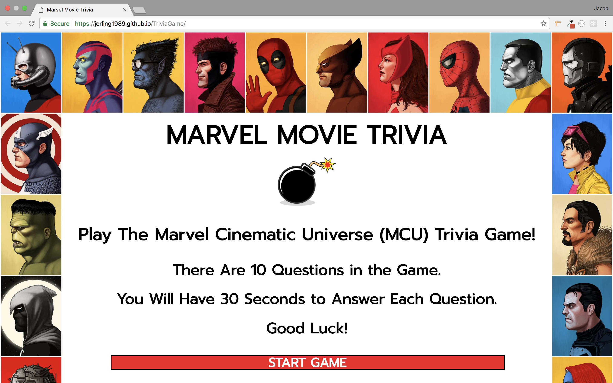
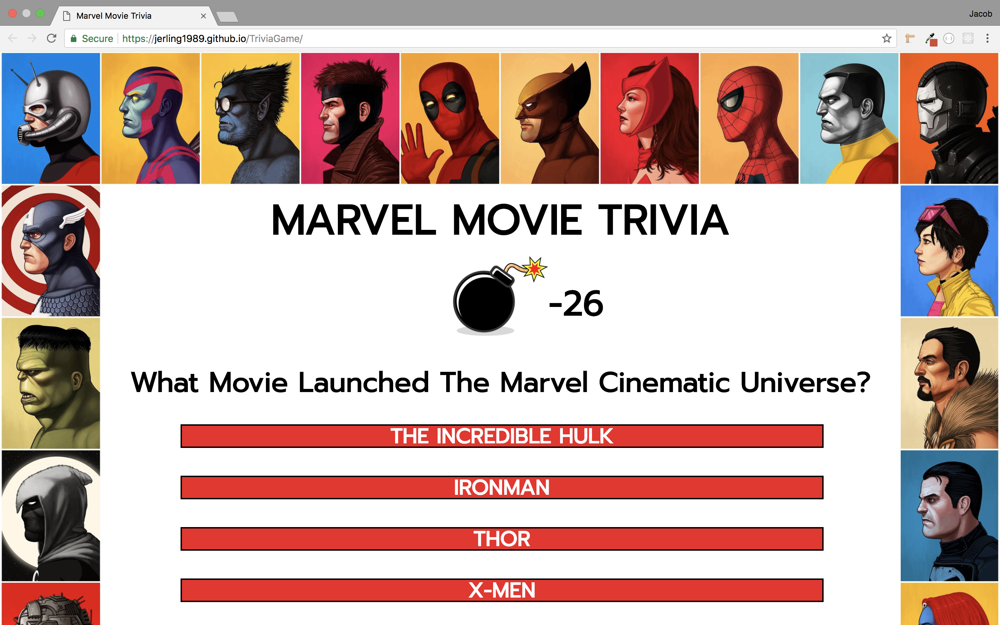
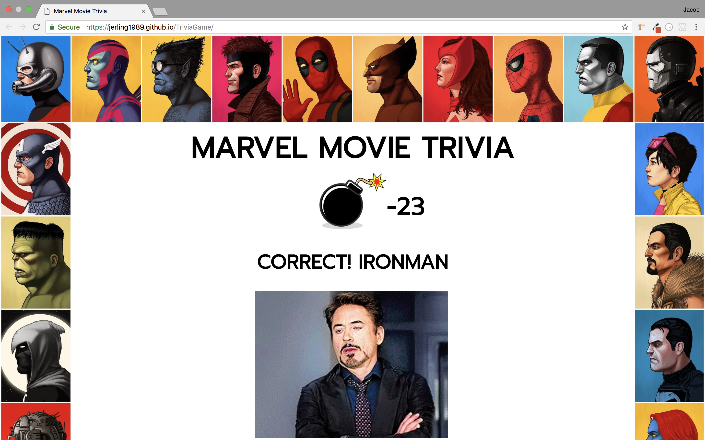
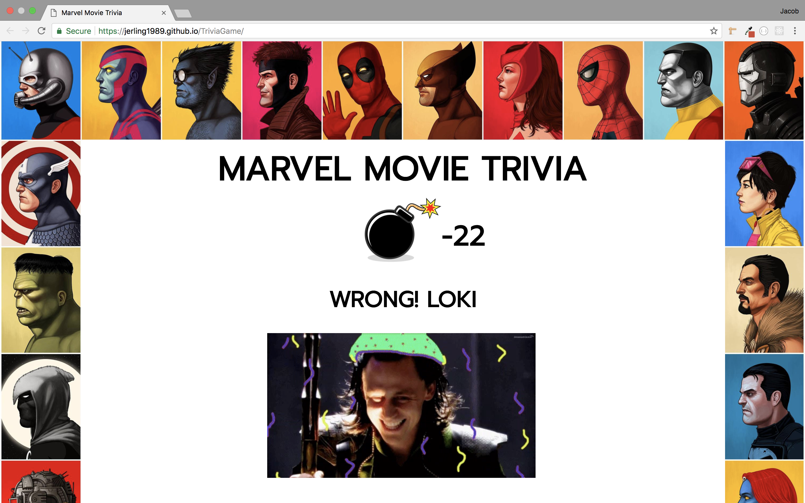
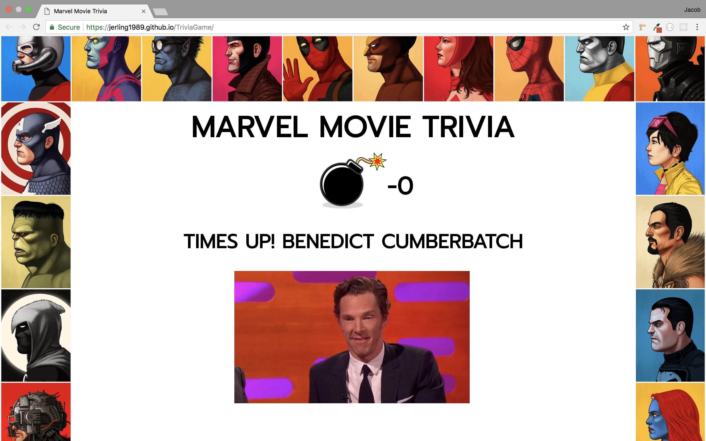
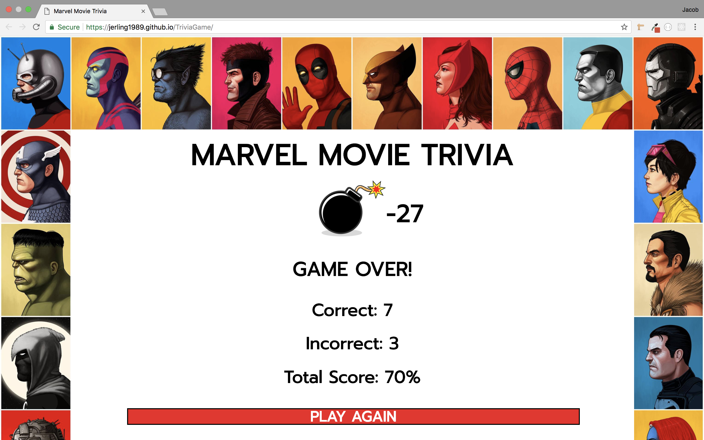

# TriviaGame
This game is a fun project I made for anyone who is a fan of the Marvel Cinematic Universe. I designed the game with HTML, CSS, and jQuery. Once the user starts the game they will get 30 seconds to answer a question about the MCU. There are 10 questions and each one is worth 10 points. Once the game is over the user will have a score of 0-100% and have the chance to start the game over.

---

- This is an image of the Start Screen for the game. The user will see the Game Title and Rules with a Button to start. They will also see a cool border of various Marvel Superheroes.

- Here is an example of one of the questions. As you can see there are four questions and a timer counting down the time left for the User to answer and score points.

